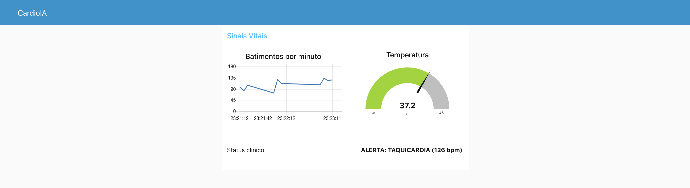
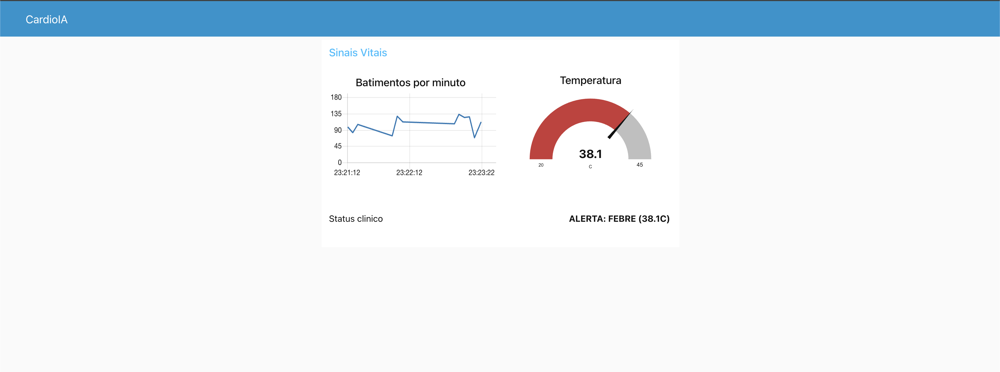

# FIAP - Faculdade de Informática e Administração Paulista

<p align="center">
<a href= "https://www.fiap.com.br/"></a>
</p>

<br>

# CardioIA — Monitoramento Cardíaco IoT com Edge, Fog e Cloud Computing

## Nome do grupo

CardioIA

## 👨‍🎓 Integrantes:
- Italo Domingues – RM 561787
- Maison Wendrel Bezerra Ramos – RM 565616

## 👩‍🏫 Professores:
### Tutor(a)
- Caique
### Coordenador(a)
- André Godoi Chiovato


## 📜 Descrição

O **CardioIA** é um protótipo de *wearable* cardiológico desenvolvido para a Fase 3, Capítulo 1 da FIAP, que demonstra o ciclo completo de IoT aplicado à saúde digital: **captura → processamento local → transmissão → visualização → alerta**. A solução integra as três camadas clássicas — **Edge**, **Fog** e **Cloud Computing** — em uma arquitetura 100% aplicável a cenários reais de monitoramento contínuo de pacientes cardiológicos.

**Projeto Wokwi:** https://wokwi.com/projects/463867704627819521

### Parte 1 — Edge Computing no ESP32

Aplicação no **Wokwi** com **ESP32** que:

- Lê sinais vitais a partir de dois sensores distintos: **DHT22** (GPIO 15) para temperatura e umidade, e **botão pull-up** (GPIO 4) tratado como sensor de batimento — o BPM é calculado a partir da contagem de cliques em janelas de 10 s.
- Armazena cada leitura em um **buffer circular em RAM** (50 amostras), substituindo o SPIFFS conforme orientação do enunciado para simuladores.
- Simula a **conectividade Wi-Fi** através de um *slide switch* (GPIO 5): em "ON" o ESP32 sincroniza o buffer com a nuvem; em "OFF" segue coletando localmente.
- Toma a **decisão de alerta no próprio dispositivo**: se `BPM > 120` (taquicardia) ou `Temp > 38 °C` (febre), o LED (GPIO 2) é aceso imediatamente — sem depender da rede.

Garante **resiliência offline**: nenhuma leitura é perdida em janelas curtas de queda de conectividade (~4 minutos com 5 s de intervalo), suficientes para os cenários típicos de uso doméstico de um wearable (elevadores, túneis, banheiros). A política de descarte é *drop-oldest*: quando o buffer enche, a leitura mais antiga é descartada, mantendo a janela recente que tem mais valor clínico.

### Parte 2 — Fog/Cloud Computing e Visualização

Sistema completo de monitoramento que:

- Publica os sinais vitais via **MQTT** no broker público `broker.hivemq.com` (tópico `cardioia/italo/sinais`, payload JSON `{ts, temp, umid, bpm}`).
- Recebe e processa as mensagens no **Node-RED** rodando localmente em Docker, com o flow exportado em `node-red/flow.json`.
- Exibe em tempo real: **gráfico de linha** com BPM (10 minutos de histórico), **gauge** de temperatura (20–45 °C com faixas verde/amarela/vermelha em 37/38 °C), e **indicador textual de alerta** que muda para vermelho quando os limiares clínicos são ultrapassados.
- Replica as regras de alerta na camada *fog*, preparando o terreno para integrações futuras (REST + e-mail, Grafana Cloud, classificadores de arritmia).

### Evidências do dashboard em execução

| Cenário | Print |
|---|---|
| Alerta de **taquicardia** (BPM = 126) — gauge verde |  |
| Alerta de **febre** (T = 38.1 °C) — gauge **vermelho** |  |


## 📁 Estrutura de pastas

Dentre os arquivos e pastas presentes na raiz do projeto, definem-se:

- <b>assets</b>: arquivos não-estruturais do repositório, como o logotipo institucional da FIAP.

- <b>docs</b>: relatórios técnicos das duas partes da atividade — `relatorio_parte1.md` (Edge Computing, mínimo 1 página) e `relatorio_parte2.md` (Fog/Cloud + dashboard, mínimo 2 páginas).

- <b>esp32</b>: artefatos do firmware do ESP32 publicados no Wokwi — `sketch.ino` (código C++ comentado), `diagram.json` (esquemático com DHT22, botão, switch e LED) e `libraries.txt` (dependências Wokwi).

- <b>node-red</b>: tudo que sobe o dashboard — `docker-compose.yml` para subir o Node-RED em container e `flow.json` para importar no editor.

- <b>simulador</b>: `simulador_esp32.py`, um publisher MQTT em Python que replica fielmente o comportamento do firmware ESP32 (mesmo buffer, mesmos limiares, mesmo payload). Serve como plano B quando a fila de compilação do Wokwi *free tier* está sobrecarregada.

- <b>screenshot</b>: evidências do dashboard funcionando com alertas reais de taquicardia e febre.

- <b>README.md</b>: este arquivo.


## 🔧 Como executar o código

### Pré-requisitos

- **Wokwi** — conta gratuita em https://wokwi.com (para a simulação do ESP32).
- **Docker** + **Docker Compose** (para o Node-RED).
- **Python 3.11+** com `paho-mqtt` (apenas para o simulador alternativo).

### 1. ESP32 no Wokwi

Acessar https://wokwi.com/projects/463867704627819521 e clicar em **▶ Start Simulation**. Interagir com o circuito:

- **Botão vermelho** — cada clique simula um batimento. Pressionar ~2 vezes por segundo para chegar perto de 120 BPM.
- **Slide switch** — alternar ON/OFF testa a sincronização do buffer offline.
- **DHT22** — clicar no componente e arrastar a temperatura para acima de 38 °C testa o alerta de febre.

O **Monitor Serial** (115200 bps) exibe os prefixos `[LEITURA]`, `[ALERTA]`, `[CLOUD-SERIAL]`, `[MQTT]` e `[SYNC]`.

### 2. Node-RED (dashboard)

```bash
cd node-red
docker compose up -d
```

1. Abrir http://localhost:1880
2. Menu **☰ → Manage palette → Install** → buscar `node-red-dashboard` → **Install** (ignorar o aviso de "deprecated").
3. Menu **☰ → Import** → escolher `node-red/flow.json` → **Import** → clicar em **Deploy**.
4. Abrir o dashboard em http://localhost:1880/ui

Para derrubar: `docker compose down` (na mesma pasta `node-red/`).

### 3. Simulador Python (plano B do Wokwi)

Quando a fila de build do Wokwi free está sobrecarregada, este script publica no broker MQTT exatamente o mesmo payload JSON que o firmware do ESP32 produziria — permite validar a Parte 2 de forma independente:

```bash
pip3 install paho-mqtt
python3 simulador/simulador_esp32.py
```

Comportamento idêntico ao firmware: mesmo buffer circular (50 amostras, drop-oldest), mesma simulação de Wi-Fi (alterna a cada 30 s) e mesmos limiares de alerta. Os prints da seção anterior foram gerados rodando esse simulador.


## 🗃 Histórico de lançamentos

* 1.0.0 - 12/05/2026
    * Entrega completa das Partes 1 e 2: firmware do ESP32 com resiliência offline em buffer circular, transmissão MQTT para o broker HiveMQ, dashboard Node-RED com gráfico de BPM, gauge de temperatura e alertas clínicos (taquicardia e febre); simulador Python equivalente como plano B para o Wokwi free tier.


## 📋 Licença

<p xmlns:cc="http://creativecommons.org/ns#" xmlns:dct="http://purl.org/dc/terms/"><a property="dct:title" rel="cc:attributionURL" href="https://github.com/agodoi/template">MODELO GIT FIAP</a> por <a rel="cc:attributionURL dct:creator" property="cc:attributionName" href="https://fiap.com.br">Fiap</a> está licenciado sobre <a href="http://creativecommons.org/licenses/by/4.0/?ref=chooser-v1" target="_blank" rel="license noopener noreferrer" style="display:inline-block;">Attribution 4.0 International</a>.</p>
